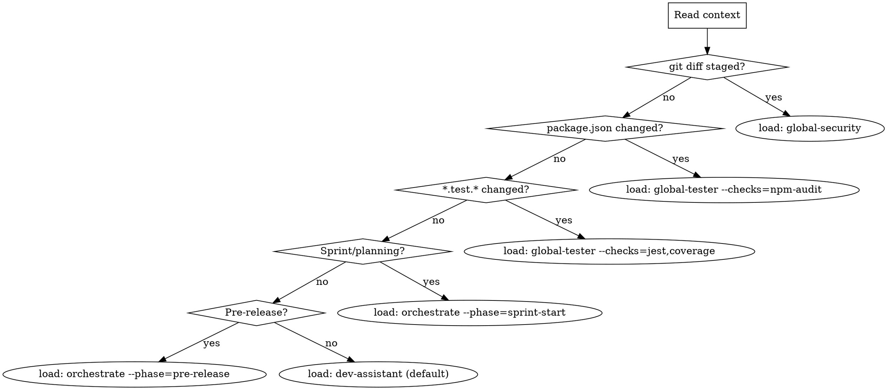

# Skills Router

Automatically determines and loads the right skill based on project context. Zero user input required.

## Decision Logic



## Context Signals → Skill Mapping

| Signal | Auto-load |
|--------|-----------|
| Staged files in git | `global-security --checks=git,linting` |
| `src/` files changed | `dev-assistant --feature=review` |
| `*.test.*` changed | `global-tester --checks=jest,coverage` |
| `package.json` changed | `global-tester --checks=npm-audit` |
| `*.scss/*.css` changed | `product-designer --feature=consistency` |
| PR URL in context | `global-security --full` |
| "sprint" / "plan" in message | `orchestrate --phase=sprint-start` |
| "launch" / "release" in message | `orchestrate --phase=pre-release` |
| "competitor" / "market" | `market-researcher` |
| "metric" / "kpi" / "roi" | `biz-analyst` |
| "user story" / "backlog" | `po-guide` |
| "component" / "design" | `product-designer` |
| New file with no test file | `qa-automation --feature=unit-stubs` |
| No signal → default | `dev-assistant` |

## How to Run This

On session start, silently:

```bash
# 1. Read context
STAGED=$(git diff --name-only --cached 2>/dev/null)
CHANGED=$(git diff --name-only 2>/dev/null)
BRANCH=$(git branch --show-current 2>/dev/null)

# 2. Determine skills needed (see mapping above)
# 3. Load them via Skill tool
# 4. Announce only if skill changes behavior
```

## Rules

- **Never ask** "which skill do you want?" — determine it from context
- **Load silently** unless the skill changes how you'll respond
- **One skill at a time** unless phase requires parallel (orchestrate handles that)
- **Verify relevance** before executing — loading ≠ acting
- If context is ambiguous → load `dev-assistant` as safe default
- If user explicitly names a skill → use that, skip routing

## Verification Before Execution

After loading a skill, verify it applies:
1. Does the skill's "Use when..." match current context? → Proceed
2. Does it NOT match? → Unload, try next signal
3. Still uncertain? → Load `dev-assistant`, state what you detected

## Red Flags (stop routing, ask user)

- Multiple conflicting high-priority signals
- User's message explicitly contradicts detected context
- Session is continuation of specific ongoing task

---

**Token cost:** 50-100 tokens (context read only, no analysis)
